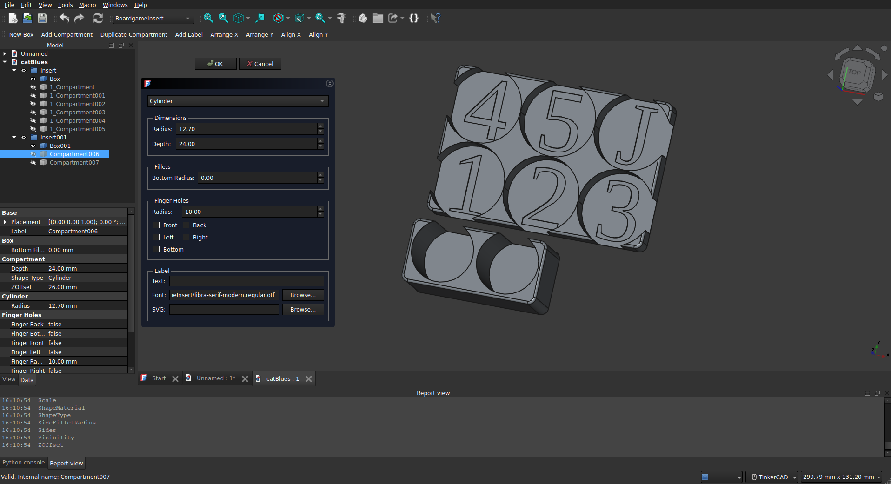

# Boardgame Insert Workbench

This is a FreeCAD 1.0 workbench designed to help design and 3d print custom inserts for board games. It provides tools to design organizers with multiple compartments for game components or individual boxes for pieces depending on your design preferrences. This could be used to create various boxes, trays and organizers, or with other fabrication techologies, but it was designed with board games and fdm printers in mind.

I roughly tried to recreate the feature set of the [Boardgame Insert Toolkit (BIT)](https://github.com/dppdppd/The-Boardgame-Insert-Toolkit) for openSCAD though there are many features there not yet implemented here (dividers, lattices, probably more). I used BIT for one design but was disappointed by the lack of fillets. I also found the syntax errors I made when using it hard to debug. Using a workbench in freeCAD allows for a WYSIWYG approach to designing inserts.

## Installation

 1. Download or clone this repository.
 2. Copy or link the "BoardgameInsertWorkbench" folder to your FreeCAD "Mod" directory. You can find the location of this directory by opening FreeCAD, going to "Edit" -> "Preferences" -> "General" -> "Macro" tab, and checking the "Macro directory" path. The "Mod" folder should be located in the same parent directory as the "Macro" folder but will typically need to be created manually.
    1. On Windows, the "Mod" directory is usually located at `C:\Users\<YourUsername>\AppData\Roaming\FreeCAD\Mod`.
    2. On Linux, the "Mod" directory is usually located at `/home/<YourUsername>/.local/share/FreeCAD/Mod`.
    3. On macOS, the "Mod" directory is usually located at `/Users/<YourUsername>/Library/Application Support/FreeCAD`
    4. Create the "Mod" folder if it does not already exist using mkdir in a terminal or use a file explorer to create it.
    5. You can clone the repository directly into the "Mod" folder or create a symbolic link to the repository location on your system (i.e. using `ln -s /path/to/BoardgameInsertWorkbench /path/to/FreeCAD/Mod/BoardgameInsertWorkbench` on Linux or macOS).
 3. Restart FreeCAD.

## Features

 * Create boxes with multiple compartments
 * Modular labels and compartments for quick re-arrangement
 * Compartment types:
    * Rectangular
    * Circular
    * N-sided polygon shapes
    * Rectangle 2 (round bottom or sideways cylinder)
 * Lots of fillet options for both boxes and compartments
 * SVG or text labels with font selection, size, and placement options
 * Optional sliding lids
 * Convenient compartment arrangement functions (align and distribute)
 * Compartment duplication tool to create multiple copies of a compartment quickly

## Useage

 1. Open FreeCAD and switch to the "Boardgame Insert" workbench from the workbench selector.
 2. Use the "Create Box" tool to create a new box for the insert adjust parameters as desired.
 3. Use the "Add Compartment" tool to add compartments to the box adjusting parameters as desired.
 4. Double click on the compartment in the tree view to move it to the desired location within the box.
 5. Repeat steps 3 and 4 as needed to add more compartments.
 6. Use the "Add Label" tool to add labels to the box or lid as desired (for lid you must select the lid specifically in the tree view before adding the label).

The defaults will create a deck box with a lid. With these basic tools you should be able to create a wide variety of inserts.

### Notes

 * The box dimensions are the absolute outer dimensions including the lid. This way you can easily design boxes to fit within a certain space.
 * Compartment depths account for the lid thickness. Just measure your stack of components and put that as the compartment depth.

## Limitations

 * Changing box/lid parameters can make labels get "lost" -- you may need to delete and re-add them
 * There are no checks to ensure compartments fit within the box; it's  a good idea to inspect the model

## Examples

Some links to examples are included in the [examples](examples.md) page. If you have the workbench installed you can open the FreeCAD files included to see how they were made.

enjoy!
